# Country Plots

``` r
library(unhcrreports)
```

Below is the library with all Country Focused questions organised around
the 7 key questions!

## 1. Category

### Key Figures

``` r
plot_ctr_keyfig(
  year = 2022,
  country_asylum_iso3c = "COL"
)
```

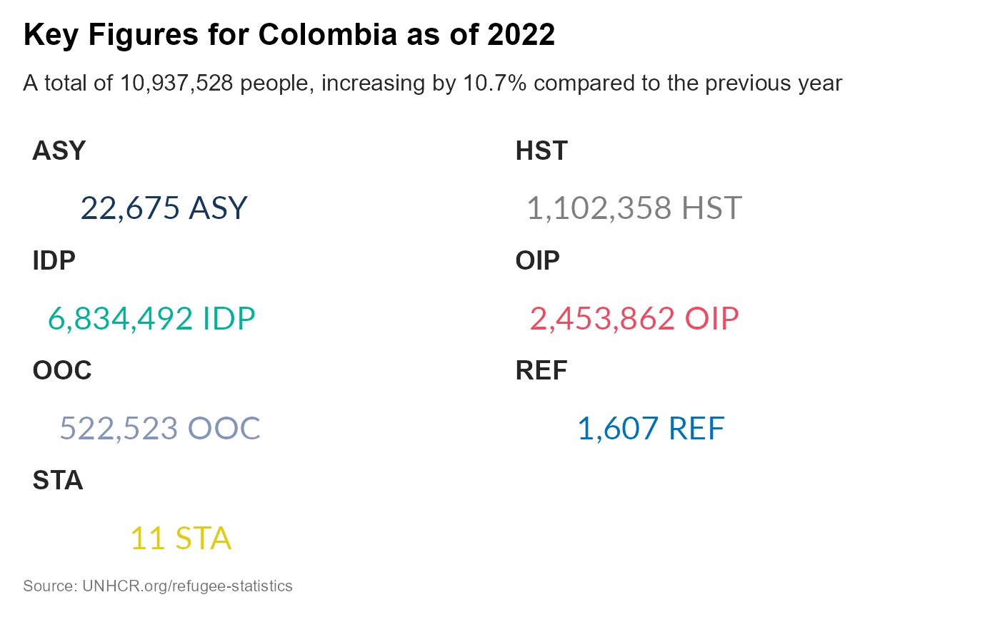

### Plot Tree Map of Categories

``` r
#
plot_ctr_treemap(
  year = 2021,
  country_asylum_iso3c = "USA"
)
```

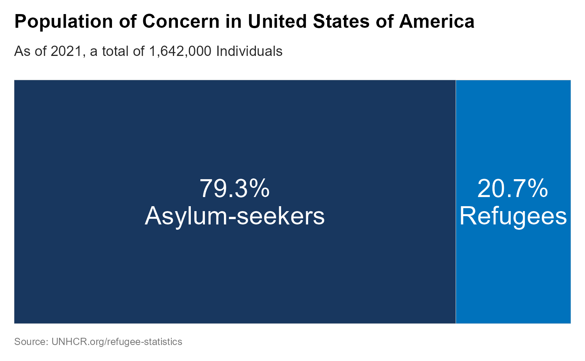

### Plot Population Type Over year

``` r
p <- plot_ctr_population_type_per_year(
  year = 2018,
  country_asylum_iso3c = "BRA",
  lag = 5,
  pop_type = c(
    "REF",
    "ASY",
    "OIP",
    "OOC",
    "STA",
    "IDP"
  )
)
p
```

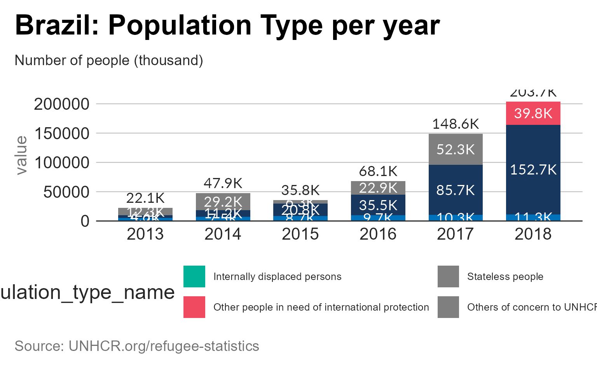

``` r
## Raw data can always be accessed with
# knitr::kable(ggplot2::ggplot_build(p)$plot$data )
```

## 2. Origin

### Plot Main country of origin in one specific country - Absolute value

``` r
plot_ctr_population_type_abs(
  year = 2020,
  country_asylum_iso3c = "USA",
  top_n_countries = 4,
  pop_type = "REF",
  show_diff_label = FALSE
)
```

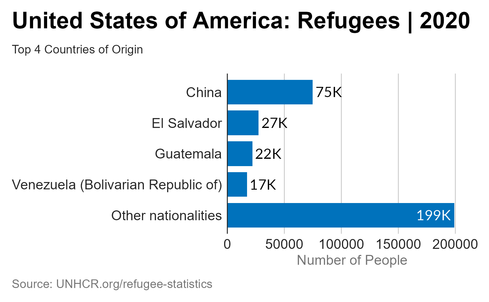

``` r

## Same with 9 top countries and Asylum-seekers included
plot_ctr_population_type_abs(
  year = 2020,
  country_asylum_iso3c = "USA",
  top_n_countries = 9,
  pop_type = "ASY",
  show_diff_label = TRUE
)
```

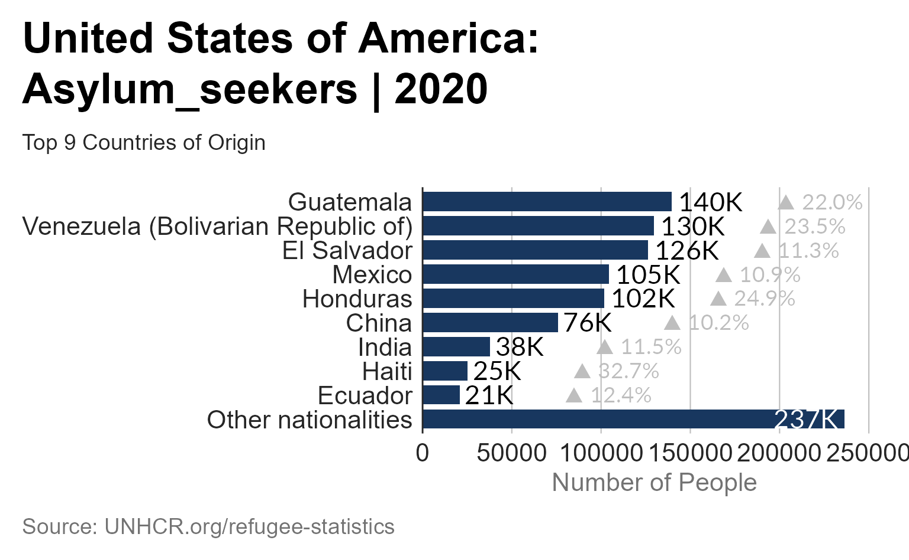

### Plot Main country of origin in one specific country - Percentage

``` r
plot_ctr_population_type_perc(
  year = 2021,
  country_asylum_iso3c = "BRA",
  top_n_countries = 9,
  pop_type = "REF",
  show_diff_label = FALSE
)
```

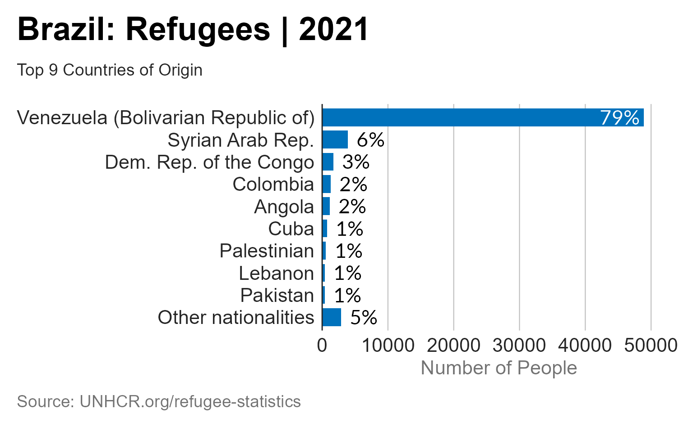

``` r

plot_ctr_population_type_perc(
  year = 2021,
  country_asylum_iso3c = "BRA",
  top_n_countries = 9,
  pop_type = "ASY",
  show_diff_label = TRUE
)
```

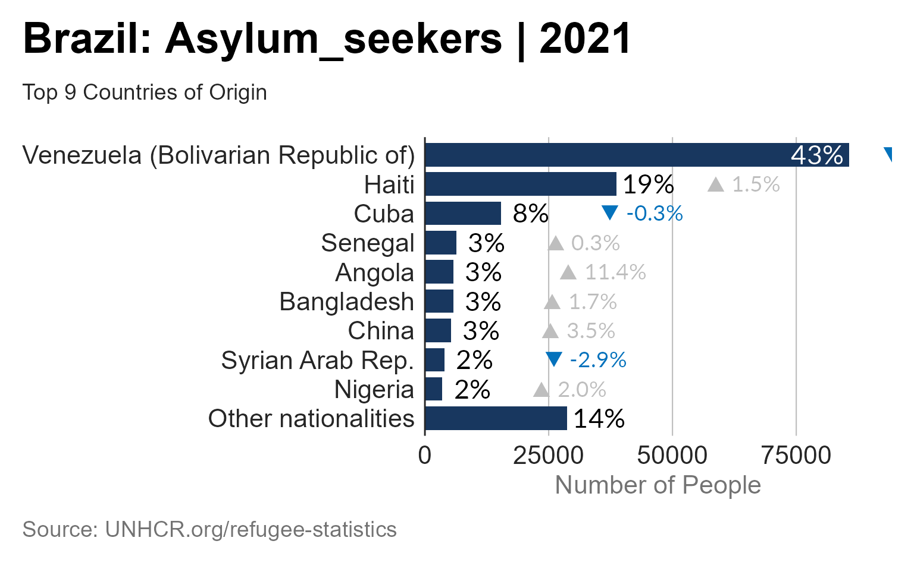

### Plot Increases and Decreases in Population Groups

``` r
#
plot_ctr_diff_in_pop_groups(
  year = 2022,
  country_asylum_iso3c = "ROU",
  pop_type = c("REF", "ASY")
)
```

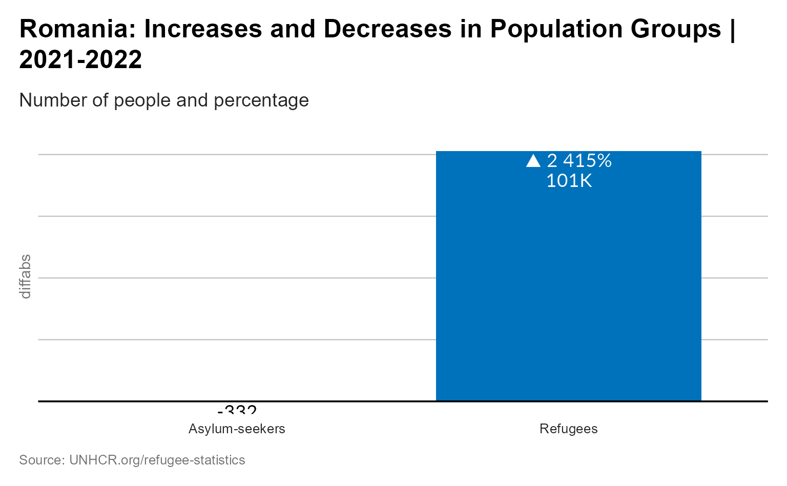

### Plot Origin History

``` r
plot_ctr_origin_history(
  year = 2022,
  lag = 5,
  country_asylum_iso3c = "MEX",
  pop_type = c(
    "REF",
    "ASY",
    "OIP",
    "IDP"
  ),
  otherprop = .02
)
```

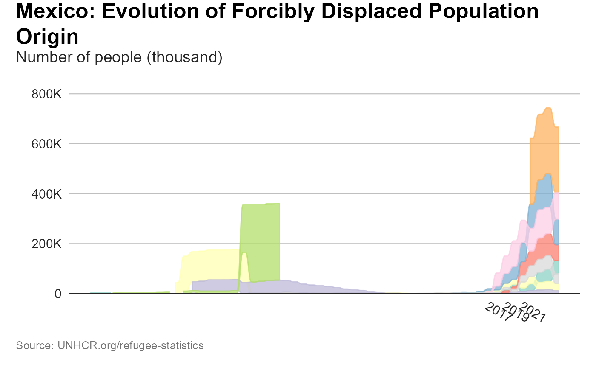

## 3. Destination

### Plot Main Destination from one specific country

``` r
#
plot_ctr_destination(
  year = 2021,
  country_origin_iso3c = "COL",
  pop_type = c("REF", "ASY")
)
```

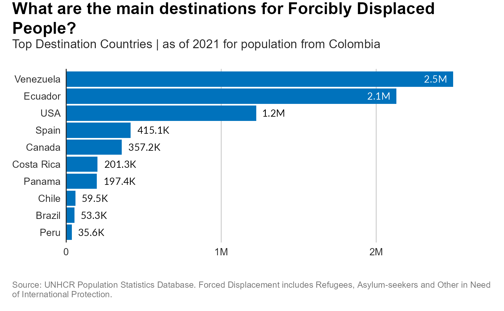

### plot recognition rate for a nationality

``` r
plot_ctr_origin_recognition(
  year = 2022,
  country_origin_iso3c = "VEN",
  top_n_countries = 10,
  measure = "RefugeeRecognitionRate",
  order_by = "TotalDecided"
)
```

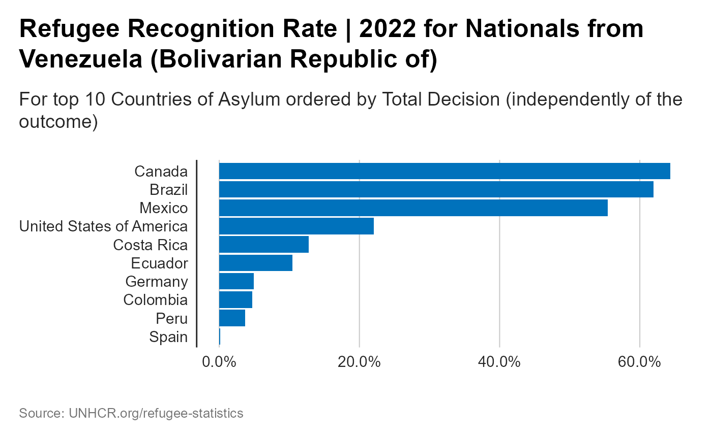

## 4. Profile

### Plot Age Pyramid

``` r
#
plot_ctr_pyramid(
  year = 2022,
  country_asylum_iso3c = "COL",
  pop_type = c("ASY", "REF")
)
```

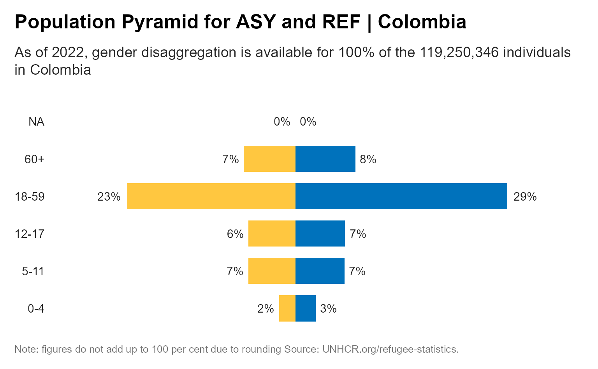

### Plot locations within countries

``` r
# plot_ctr_location(year = 2022,
#                  country_asylum_iso3c = "COL",
#                  pop_type = c("ASY", "REF", "OIP"))
#
# plot_ctr_location(year = 2021,
#                  country_asylum_iso3c = "COL",
#                  pop_type = c("IDP"))
#
# plot_ctr_location(year = 2022,
#                  country_asylum_iso3c = "CAN",
#                  pop_type = c("ASY", "REF", "OIP"))
#
# plot_ctr_location(year = 2021,
#                  country_asylum_iso3c = "MEX",
#                  pop_type = c("ASY", "REF", "OIP"))
```

## 5. Processing

### Plot Refugee Recognition rate in Country

``` r
plot_ctr_recognition(
  year = 2022,
  country_asylum_iso3c = "USA",
  top_n_countries = 10,
  measure = "RefugeeRecognitionRate",
  order_by = "TotalDecided"
)
```

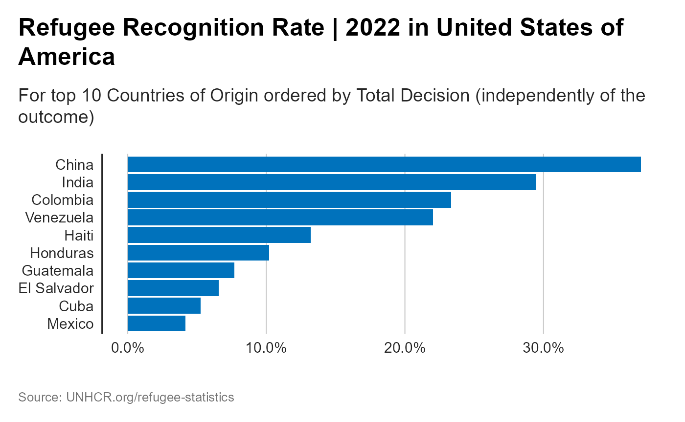

### Asylum Applications & Decision over time

``` r
plot_ctr_asylum(
  year = 2022,
  country_asylum_iso3c = "ECU",
  lag = 10
)
#> Joining with `by = join_by(year, CountryAsylumCode)`
```


### Asylum Processing

``` r
plot_ctr_process(year = 2022, country_asylum_iso3c = "BOL")
```

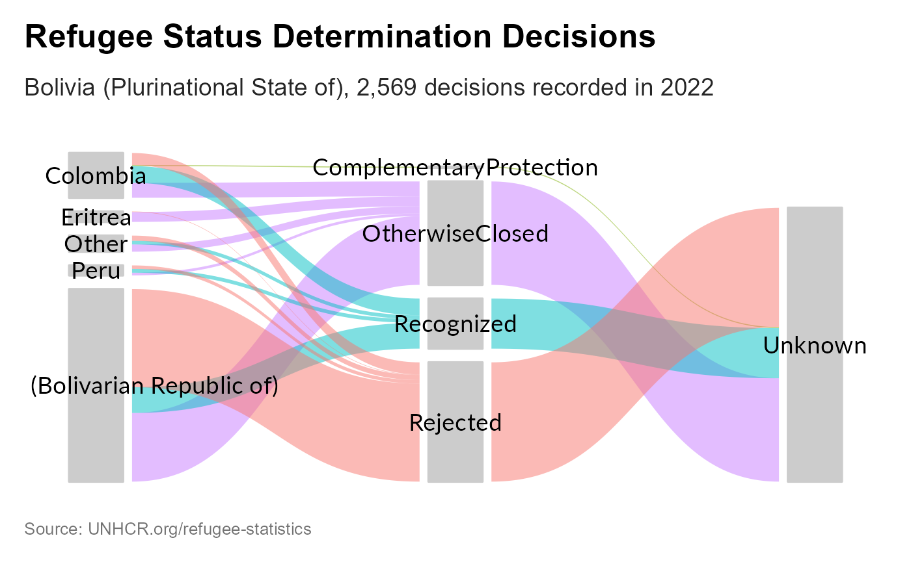

``` r

plot_ctr_process(year = 2022, country_asylum_iso3c = "CHL")
```

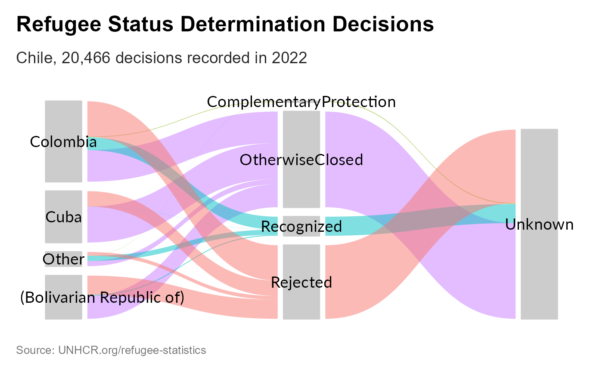

``` r


plot_ctr_process(
  year = 2022, country_asylum_iso3c = "USA",
  otherprop = .02
)
```

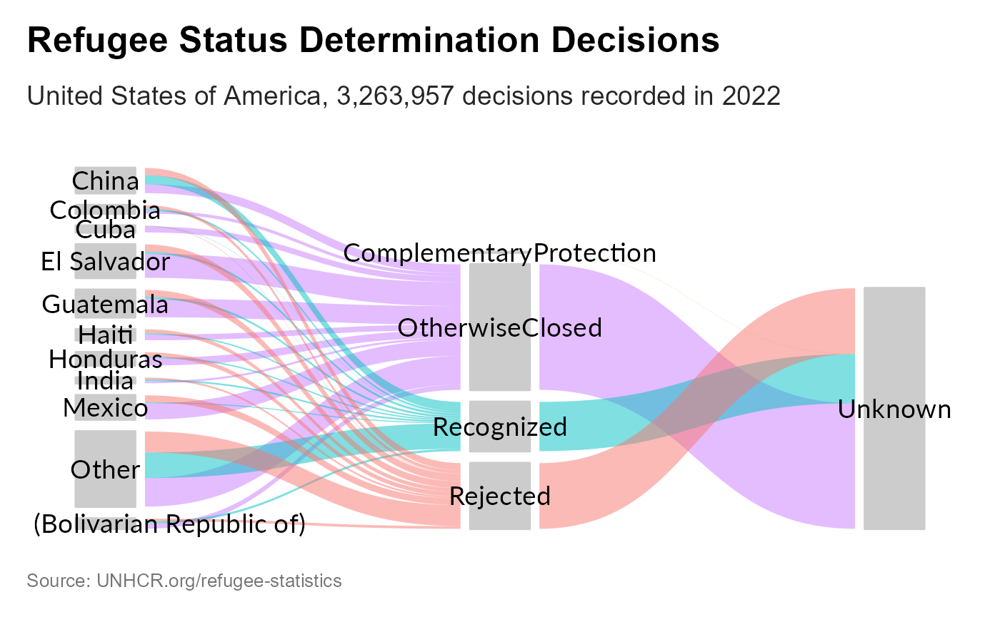

``` r

plot_ctr_process(
  year = 2022, country_asylum_iso3c = "USA",
  otherprop = .04
)
```

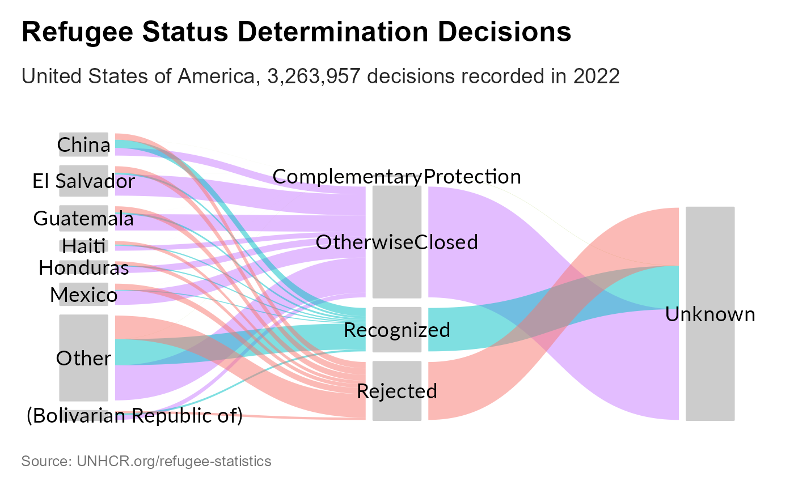

### Average Asylum Processing Time

``` r
plot_ctr_processing_time(
  year = 2022,
  country_asylum_iso3c = "ARG"
)
```


``` r


plot_ctr_processing_time(
  year = 2022,
  country_asylum_iso3c = "USA"
)
```

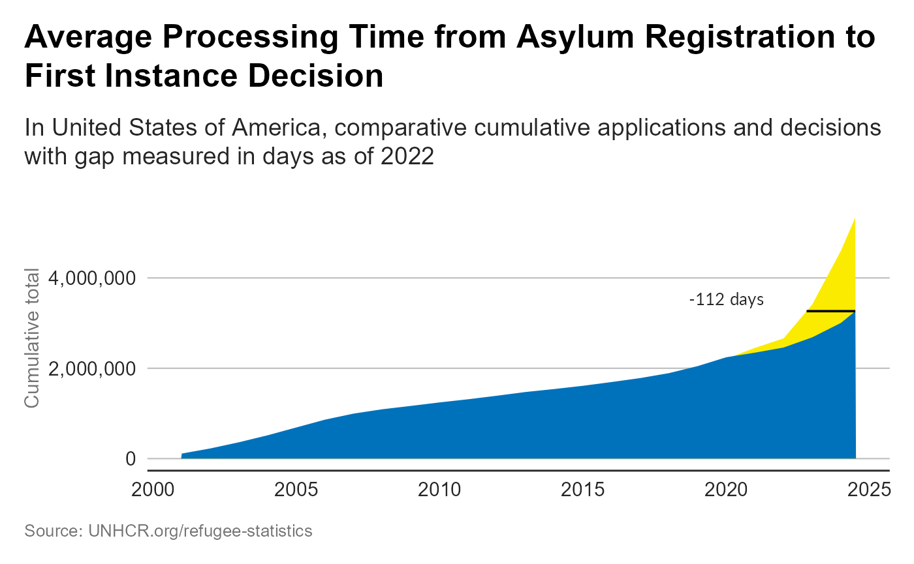

``` r

## Display a filtered version of the chart for a specific country and procedure
plot_ctr_processing_time(
  year = 2022,
  country_asylum_iso3c = "EGY",
  country_origin_iso3c = "ERI",
  procedureType = "U"
)
```

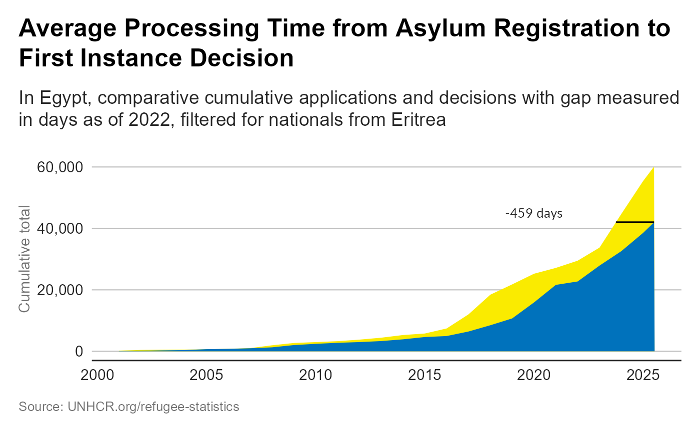

## 6. Solutions

### Plot Solution Over time

``` r
plot_ctr_solution(
  year = 2021,
  country_asylum_iso3c = "UGA",
  lag = 10,
  sol_type = c("NAT", "RST", "RET", "RDP")
)
```

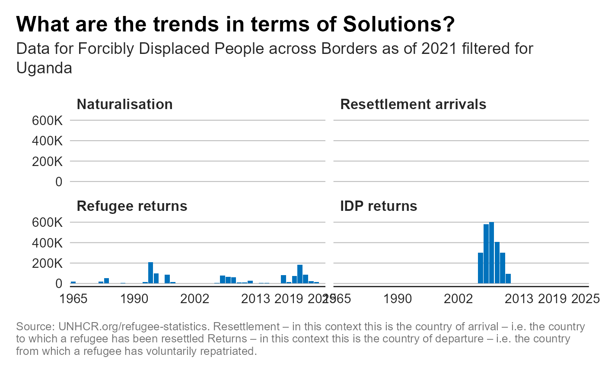

### Plot Solution Over Recognition

## 7.Migrant

### plot share displaced / migrant for world - region - subregion

bar with share

### Plot share displaced / migrant for top countries

dumbel

### Plot Ratio Refugee Migrant

``` r
plot_ctr_disp_migrant(
  year = 2022,
  country_asylum_iso3c = "MEX",
  top_n_countries = 10
)
```


``` r
# plot_ctr_disp_migrant(year = 2022,
#                     country_asylum_iso3c = "FRA" )
```

------------------------------------------------------------------------

## Refresh package
