# Region Plots

``` r
library(unhcrreports)
```

### Population group in the region

``` r
plot_reg_treemap(year = 2022, region = "The Americas")
#> Warning: There was 1 warning in `dplyr::mutate()`.
#> ℹ In argument: `unhcr_region = countrycode::countrycode(coa_iso, "iso3c",
#>   "unhcr.region")`.
#> Caused by warning:
#> ! Some values were not matched unambiguously: UNK
```

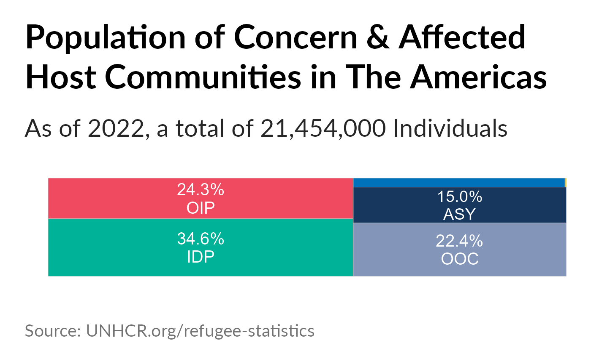

### Plot World Comparison

``` r
plot_reg_share(
  year = 2022,
  region = "The Americas",
  pop_type = "REF"
)
#> Warning: There was 1 warning in `dplyr::mutate()`.
#> ℹ In argument: `unhcr_region = countrycode::countrycode(coa_iso, "iso3c",
#>   "unhcr.region")`.
#> Caused by warning:
#> ! Some values were not matched unambiguously: UNK
```

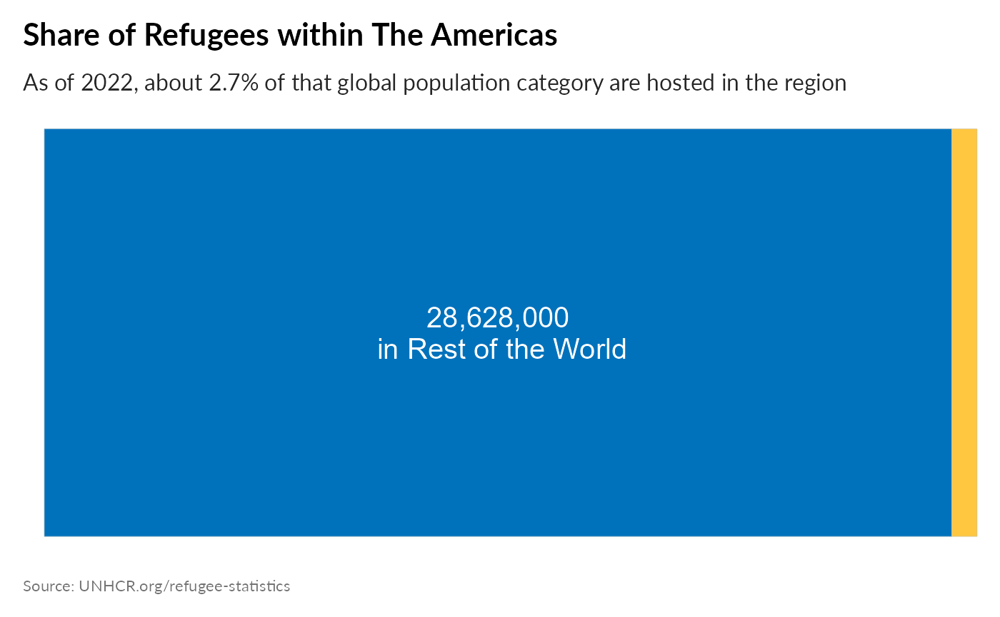

``` r
plot_reg_share(
  year = 2022,
  region = "The Americas",
  pop_type = "ASY"
)
#> Warning: There was 1 warning in `dplyr::mutate()`.
#> ℹ In argument: `unhcr_region = countrycode::countrycode(coa_iso, "iso3c",
#>   "unhcr.region")`.
#> Caused by warning:
#> ! Some values were not matched unambiguously: UNK
```

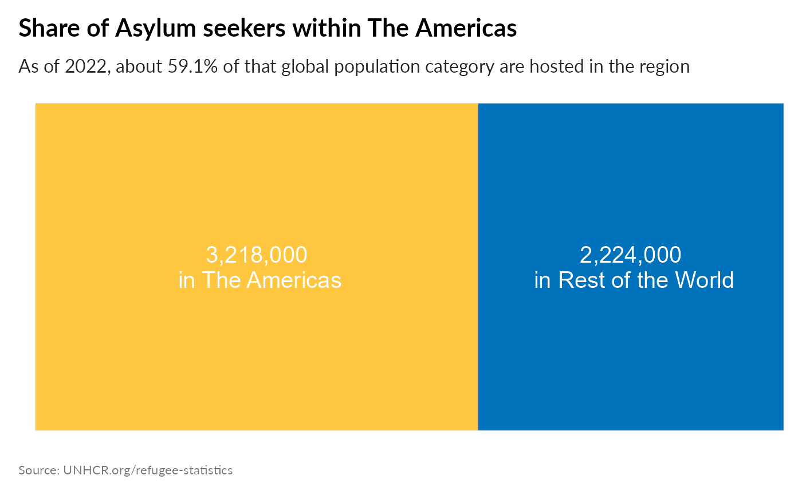

``` r
plot_reg_share(
  year = 2022,
  region = "The Americas",
  pop_type = "OIP"
)
#> Warning: There was 1 warning in `dplyr::mutate()`.
#> ℹ In argument: `unhcr_region = countrycode::countrycode(coa_iso, "iso3c",
#>   "unhcr.region")`.
#> Caused by warning:
#> ! Some values were not matched unambiguously: UNK
```

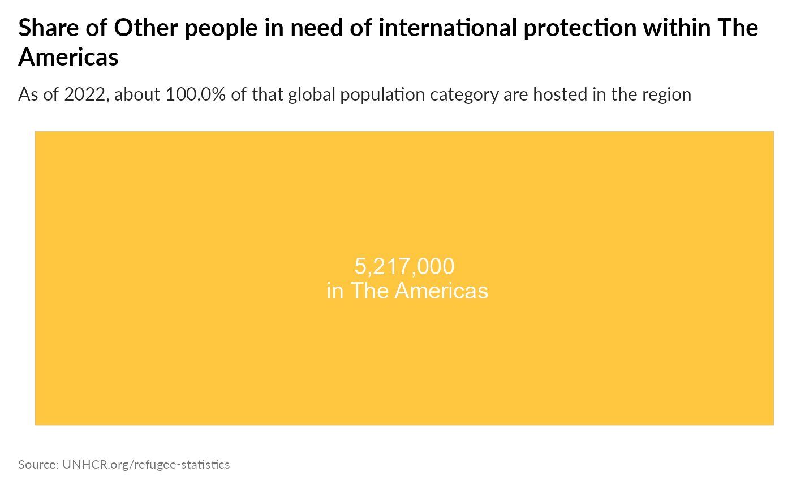

``` r
plot_reg_share(
  year = 2022,
  region = "The Americas",
  pop_type = "IDP"
)
#> Warning: There was 1 warning in `dplyr::mutate()`.
#> ℹ In argument: `unhcr_region = countrycode::countrycode(coa_iso, "iso3c",
#>   "unhcr.region")`.
#> Caused by warning:
#> ! Some values were not matched unambiguously: UNK
```

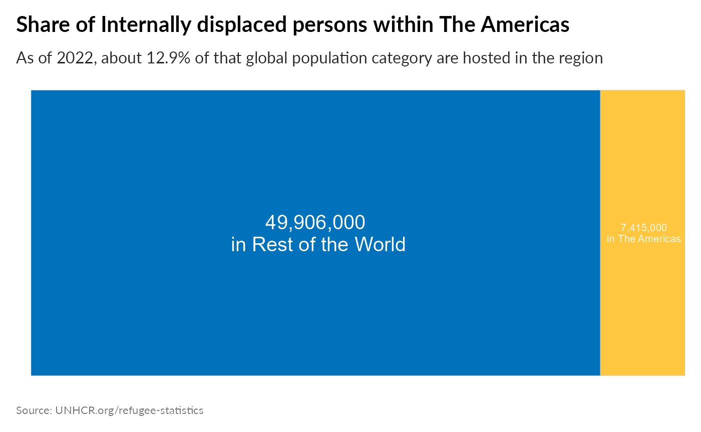

``` r
plot_reg_share(
  year = 2022,
  region = "The Americas",
  pop_type = "STA"
)
#> Warning: There was 1 warning in `dplyr::mutate()`.
#> ℹ In argument: `unhcr_region = countrycode::countrycode(coa_iso, "iso3c",
#>   "unhcr.region")`.
#> Caused by warning:
#> ! Some values were not matched unambiguously: UNK
```

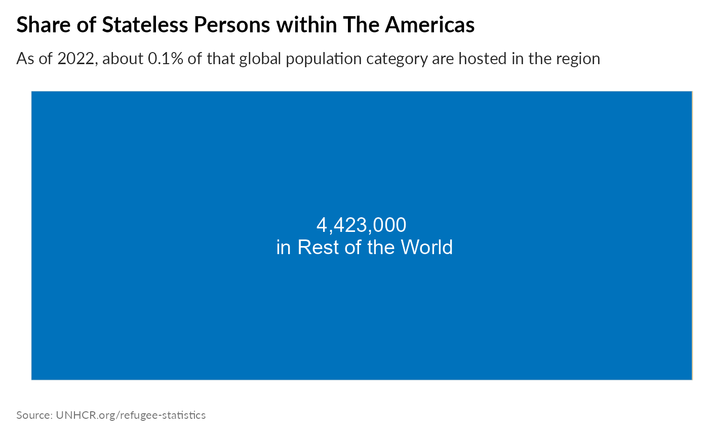

### Evolution Over Time

``` r
plot_reg_population_type_per_year(
  year = 2022,
  lag = 5,
  region = "The Americas",
  pop_type = c("REF", "ASY", "IDP", "OIP", "STA", "OOC")
)
#> Warning: There was 1 warning in `dplyr::mutate()`.
#> ℹ In argument: `unhcr_region = countrycode::countrycode(coa_iso, "iso3c",
#>   "unhcr.region")`.
#> Caused by warning:
#> ! Some values were not matched unambiguously: UNK
#> Warning: Using `size` aesthetic for lines was deprecated in ggplot2 3.4.0.
#> ℹ Please use `linewidth` instead.
#> ℹ The deprecated feature was likely used in the unhcrreports package.
#>   Please report the issue to the authors.
#> This warning is displayed once every 8 hours.
#> Call `lifecycle::last_lifecycle_warnings()` to see where this warning was
#> generated.
```

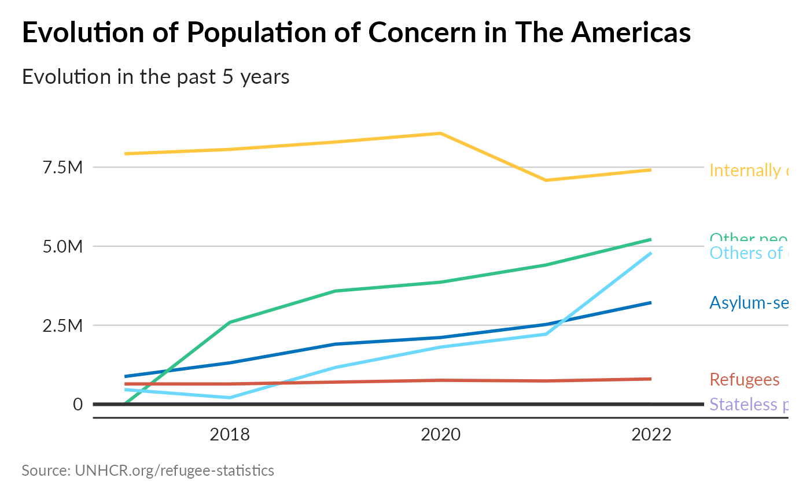

### Plot Population Origin-Destination within the region

``` r
plot_reg_origin_dest(year = 2022, region = "Asia and the Pacific")
#> Warning: There was 1 warning in `dplyr::mutate()`.
#> ℹ In argument: `unhcr_region = countrycode::countrycode(coa_iso, "iso3c",
#>   "unhcr.region")`.
#> Caused by warning:
#> ! Some values were not matched unambiguously: UNK
```

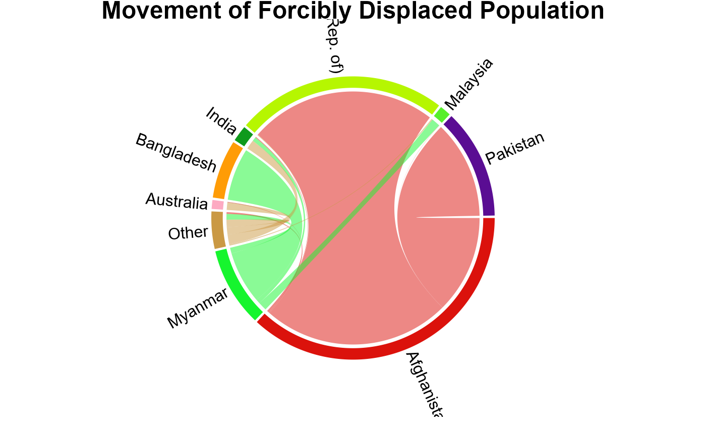

### Plot Main country of Asylum in the Region

``` r
plot_reg_population_type_abs(
  year = 2022,
  region = "The Americas",
  top_n_countries = 5,
  pop_type = "REF",
  show_diff_label = TRUE
)
#> Warning: There was 1 warning in `dplyr::mutate()`.
#> ℹ In argument: `unhcr_region = countrycode::countrycode(coa_iso, "iso3c",
#>   "unhcr.region")`.
#> Caused by warning:
#> ! Some values were not matched unambiguously: UNK
```

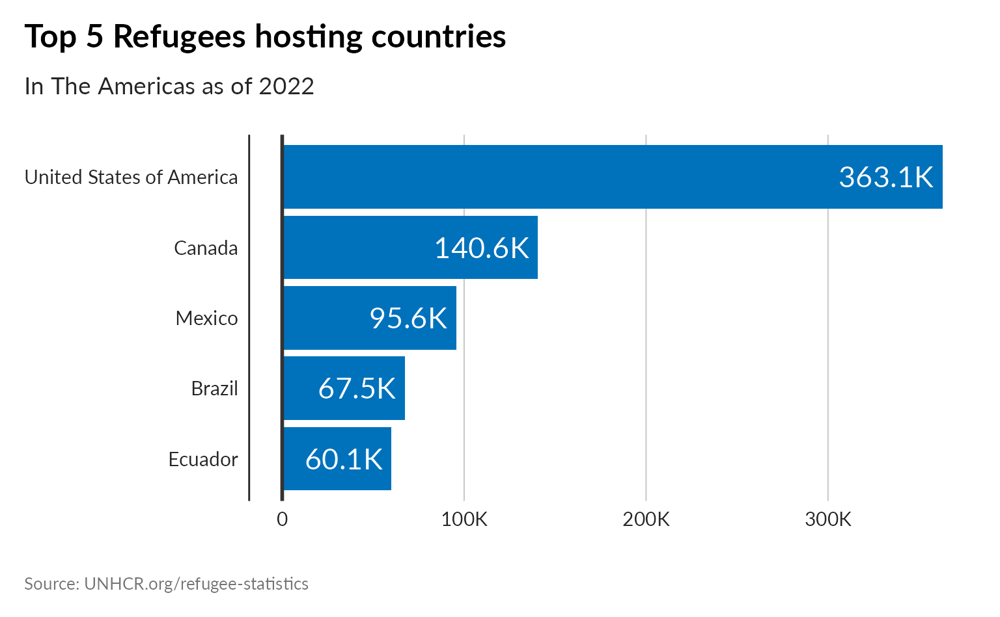

``` r

plot_reg_population_type_abs(
  year = 2022,
  region = "The Americas",
  top_n_countries = 5,
  pop_type = "ASY",
  show_diff_label = FALSE
)
#> Warning: There was 1 warning in `dplyr::mutate()`.
#> ℹ In argument: `unhcr_region = countrycode::countrycode(coa_iso, "iso3c",
#>   "unhcr.region")`.
#> Caused by warning:
#> ! Some values were not matched unambiguously: UNK
```

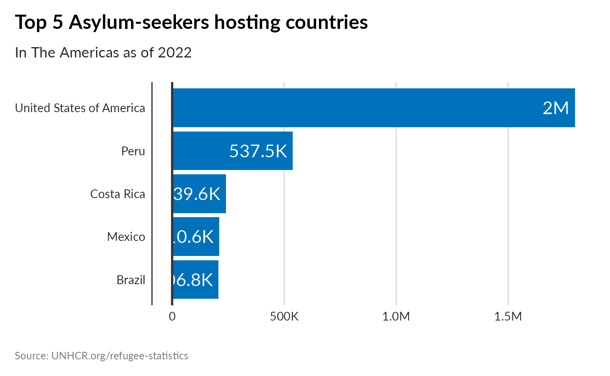

### Plot Biggest decrease in Refugee Population

``` r
plot_reg_decrease(
  year = 2021,
  lag = 5,
  topn = 5,
  region = "The Americas",
  pop_type = c("REF", "ASY", "OIP")
)
#> Warning: There was 1 warning in `dplyr::mutate()`.
#> ℹ In argument: `unhcr_region = countrycode::countrycode(coa_iso, "iso3c",
#>   "unhcr.region")`.
#> Caused by warning:
#> ! Some values were not matched unambiguously: UNK
```

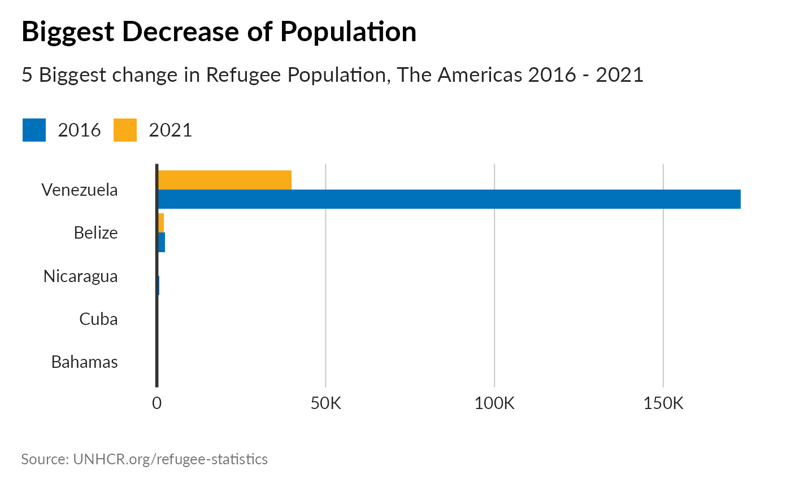

### Plot Biggest increase in Refugee Population

``` r
plot_reg_increase(
  year = 2021,
  lag = 5,
  topn = 5,
  region = "The Americas",
  pop_type = c("REF", "ASY", "OIP")
)
#> Warning: There was 1 warning in `dplyr::mutate()`.
#> ℹ In argument: `unhcr_region = countrycode::countrycode(coa_iso, "iso3c",
#>   "unhcr.region")`.
#> Caused by warning:
#> ! Some values were not matched unambiguously: UNK
```


``` r

plot_reg_increase(
  year = 2021,
  lag = 5,
  topn = 5,
  region = "Asia and the Pacific",
  pop_type = c("REF", "ASY", "OIP")
)
#> Warning: There was 1 warning in `dplyr::mutate()`.
#> ℹ In argument: `unhcr_region = countrycode::countrycode(coa_iso, "iso3c",
#>   "unhcr.region")`.
#> Caused by warning:
#> ! Some values were not matched unambiguously: UNK
```

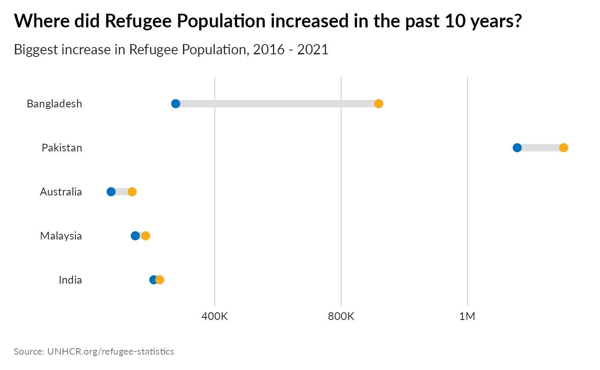

### Proportion of the population who are refugees, by country of origin (SDG indicator 10.7.4 )

``` r
plot_reg_prop_origin(year = 2022, region = "The Americas")
#> Warning: There was 1 warning in `dplyr::mutate()`.
#> ℹ In argument: `unhcr_region = countrycode::countrycode(coo_iso, "iso3c",
#>   "unhcr.region")`.
#> Caused by warning:
#> ! Some values were not matched unambiguously: TIB, UNK, XXA
```

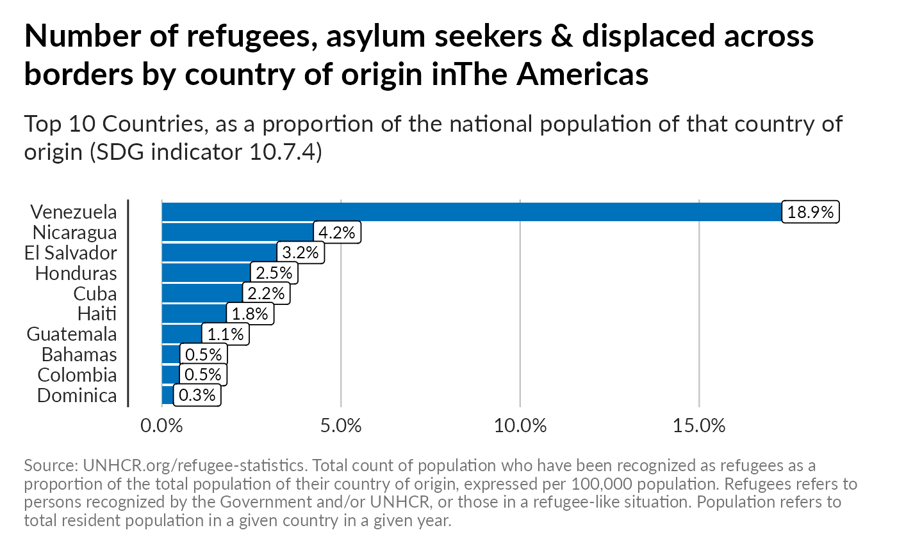

### Decision on Refugee Status Determination

``` r
plot_reg_rsd(
  year = 2022,
  region = "The Americas",
  top_n_countries = 10,
  measure = "Recognized"
)
#> Scale for y is already present.
#> Adding another scale for y, which will replace the existing scale.
```

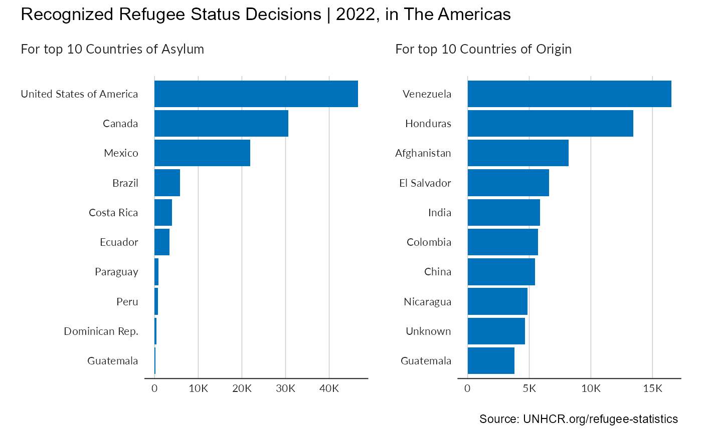

``` r


plot_reg_rsd(
  year = 2022,
  region = "The Americas",
  top_n_countries = 5,
  measure = "ComplementaryProtection"
)
#> Scale for y is already present.
#> Adding another scale for y, which will replace the existing scale.
```

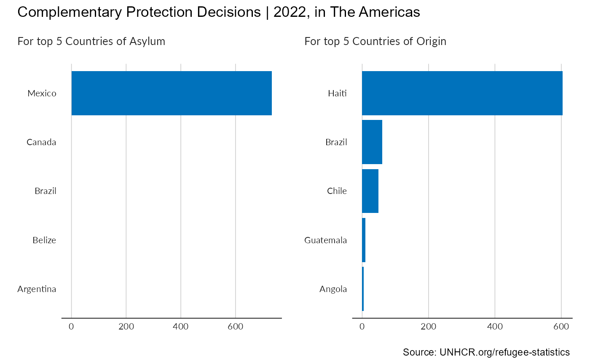

``` r


plot_reg_rsd(
  year = 2022,
  region = "The Americas",
  top_n_countries = 10,
  measure = "TotalDecided"
)
#> Scale for y is already present.
#> Adding another scale for y, which will replace the existing scale.
```

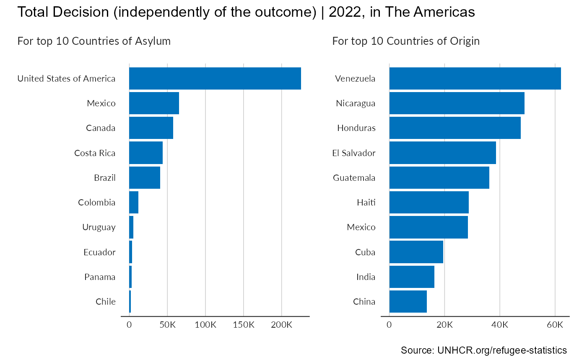

``` r


plot_reg_rsd(
  year = 2022,
  region = "The Americas",
  top_n_countries = 10,
  measure = "RefugeeRecognitionRate"
)
#> Scale for y is already present.
#> Adding another scale for y, which will replace the existing scale.
```


``` r


plot_reg_rsd(
  year = 2022,
  region = "The Americas",
  top_n_countries = 10,
  measure = "TotalRecognitionRate"
)
#> Scale for y is already present.
#> Adding another scale for y, which will replace the existing scale.
```

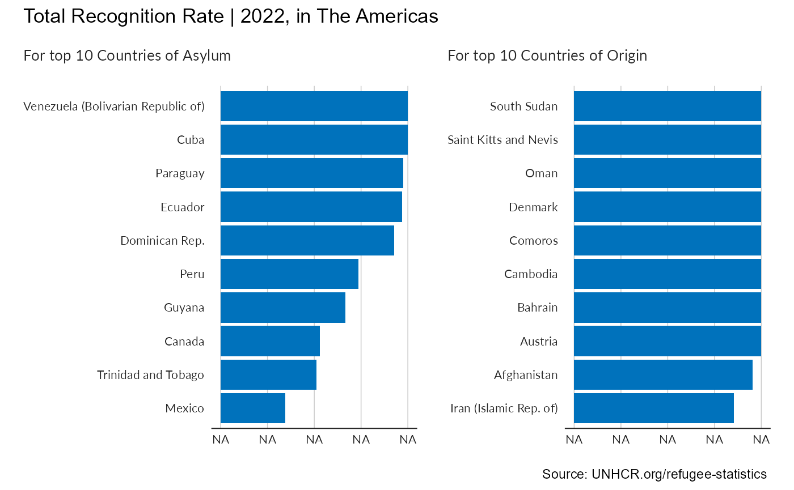

``` r


# plot_reg_rsd(year = 2022,
#              region = "Europe",
#                         top_n_countries = 10,
#                         measure = "Recognized")
```

### Plot Evolution of Solutions in the Region

``` r
plot_reg_solution(
  year = 2022,
  region = "The Americas",
  lag = 10
)
#> Warning: There was 1 warning in `dplyr::mutate()`.
#> ℹ In argument: `unhcr_region = countrycode::countrycode(coa_iso, "iso3c",
#>   "unhcr.region")`.
#> Caused by warning:
#> ! Some values were not matched unambiguously: UNK
#> Warning: Removed 123 rows containing missing values or values outside the scale range
#> (`geom_line()`).
```

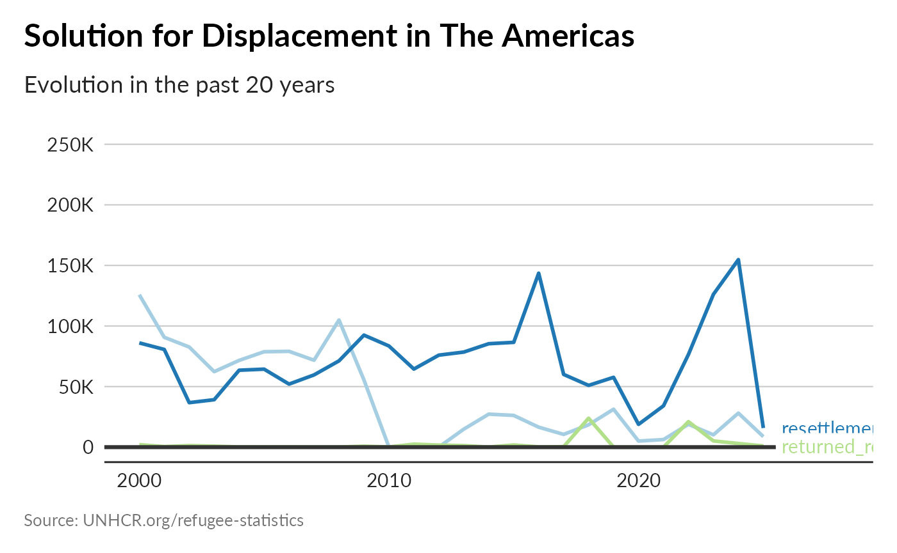

### Mapping Population

``` r
plot_reg_map(
  year = 2022,
  region = "Asia and the Pacific",
  topn = 5,
  pop_type = c("REF", "ASY", "OIP"),
  projection = "Mercator",
  maxSymbolsize = .25
)
#> Warning: There was 1 warning in `dplyr::mutate()`.
#> ℹ In argument: `unhcr_region = countrycode::countrycode(coa_iso, "iso3c",
#>   "unhcr.region")`.
#> Caused by warning:
#> ! Some values were not matched unambiguously: UNK
#> Warning: There was 1 warning in `stopifnot()`.
#> ℹ In argument: `unhcr_region = countrycode::countrycode(iso_a3, "iso3c",
#>   "unhcr.region")`.
#> Caused by warning:
#> ! Some values were not matched unambiguously: -99, ATF, FLK, TWN
#> Warning in CPL_crs_from_input(x): GDAL Message 1: +init=epsg:XXXX syntax is
#> deprecated. It might return a CRS with a non-EPSG compliant axis order.
#> 'bg', 'fg', 'tab', 'pos', 'inner', 'line', 'cex' and 'font' are deprecated arguments.
#> 6 'NA' values are not plotted on the map.
#> 4 '0' values are not plotted on the map.
```

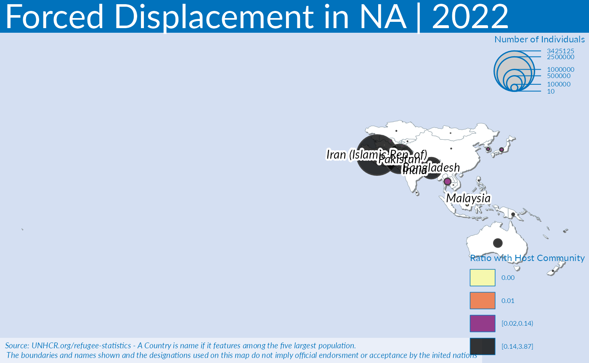

``` r


# plot_reg_map(  year = 2022,
#                             region = "WestAfrica",
#                             topn = 5,
#                             pop_type =  c("REF", "ASY", "OIP"),
#                             projection = "Mercator",
#                             maxSymbolsize = .25)
```

------------------------------------------------------------------------

## Refresh package
